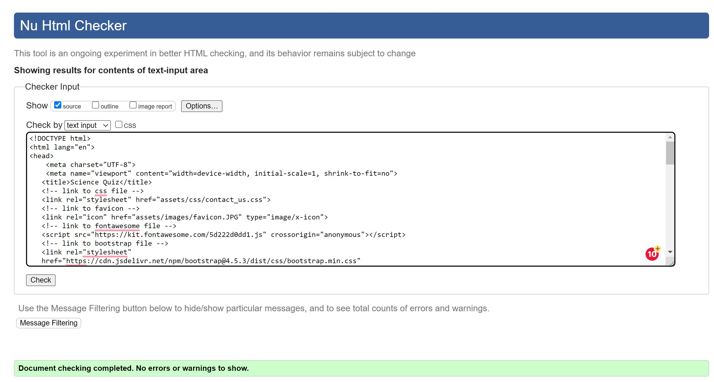
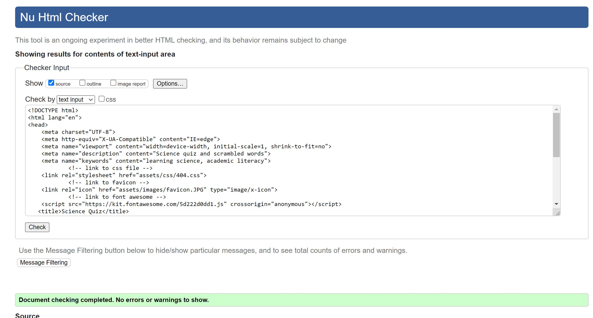
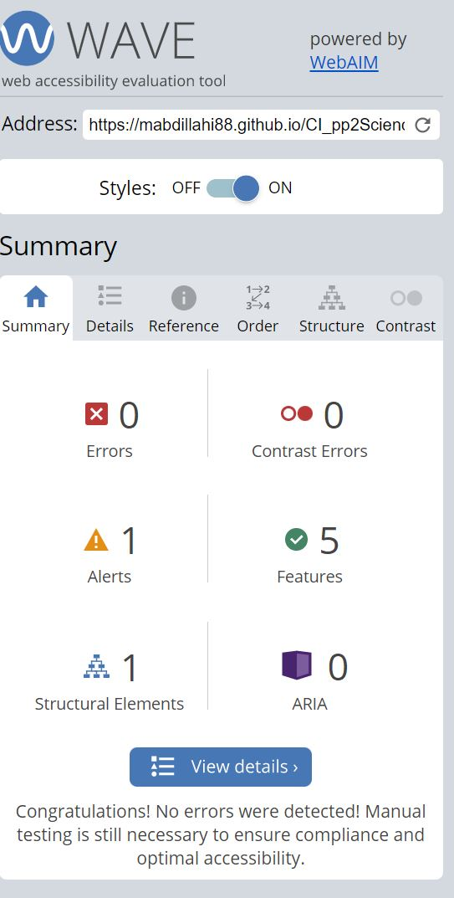
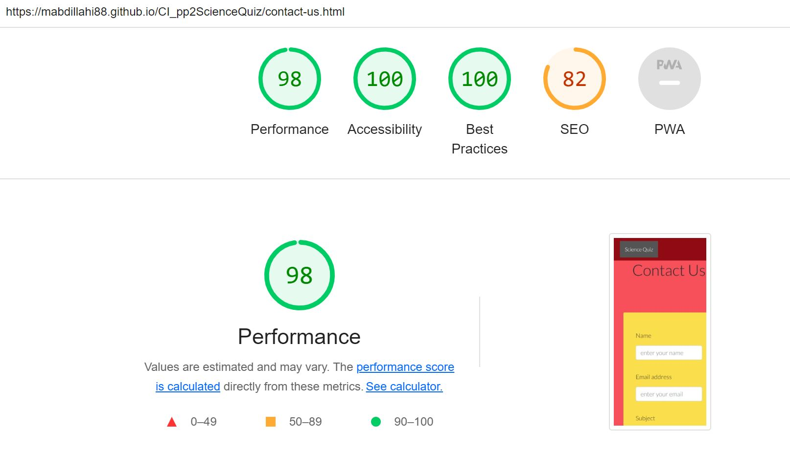

# Science Quiz
(Developer: Mohamed Abdillahi)

[Live webpage](https://mabdillahi88.github.io/CI_pp2ScienceQuiz/)

## Table of Content

1. [Project Goals](#project-goals)
    1. [User Goals](#user-goals)
    2. [Site Owner Goals](#site-owner-goals)
2. [User Experience](#user-experience)
    1. [Target Audience](#target-audience)
    2. [User Requrements and Expectations](#user-requrements-and-expectations)
    3. [User Stories](#user-stories)
3. [Design](#design)
    1. [Design Choices](#design-choices)
    2. [Colour](#colours)
    3. [Fonts](#fonts)
    4. [Structure](#structure)
    5. [Wireframes](#wireframes)
4. [Technologies Used](#technologies-used)
    1. [Languages](#languages)
    2. [Frameworks & Tools](#frameworks-&-tools)
5. [Features](#features)
6. [Testing](#validation)
    1. [HTML Validation](#HTML-validation)
    2. [CSS Validation](#CSS-validation)
    3. [Accessibility](#accessibility)
    4. [Performance](#performance)
    5. [JavaScript Validation](#javascript-validation)
    6. [Device testing](#performing-tests-on-various-devices)
    7. [Browser compatibility](#browser-compatability)
    8. [Testing user stories](#testing-user-stories)
9. [Bugs](#Bugs)
10. [Deployment](#deployment)
11. [Credits](#credits)
12. [Acknowledgements](#acknowledgements)

## **Project Goals**

The goal of this project is to deliver an engaging and user-friendly platform featuring a **True/False Game**. Additionally, the website provides features for users to interact with the developer via a **Contact Us** page and track their scores on a **Leaderboard**.

---

## **User Goals**
- Play an engaging and educational True/False game.
- Track scores on the leaderboard and compare them with others.
- Contact the developer easily to provide feedback or ask questions.

---

## **Site Owner Goals**
- Deliver a visually appealing, intuitive, and engaging True/False game.
- Ensure the game is accessible and responsive on all devices.
- Provide users with a functional leaderboard to track their performance.
- Make it easy for users to communicate feedback or questions through the contact form.

---

## **User Experience**

### **Target Audience**
- Individuals who enjoy quiz-style games, particularly True/False challenges.
- People looking for a quick, fun, and easy-to-play game.

### **User Expectations**
- Clear navigation and intuitive instructions for playing the game.
- Responsive design for a smooth experience on desktop, tablet, and mobile devices.
- A leaderboard to track and compare scores with others.
- A simple contact form to reach the developer with confirmation of successful message submission.

---

## **User Stories**

### **As a User:**
1. I want to navigate between the **Home**, **Leaderboard**, and **Contact Us** pages easily.
2. I want the rules of the True/False game to be simple to understand so I can start playing immediately.
3. I want to be able to play the game using buttons for True and False, with clear feedback on my answers.
4. I want to track my score in real-time while playing the game.
5. I want a timer to know how much time I have left to answer questions.
6. I want to see the final score at the end of the game to track my performance.
7. I want to check my ranking and compare my score with others on the **Leaderboard** page.
8. I want the website to be responsive so I can play the game on desktop, tablet, or mobile devices.
9. I want to contact the developer easily via the **Contact Us** page if I have questions or feedback.
10. I want confirmation when my message is successfully sent through the contact form.
11. I want to be redirected to a custom **404 error page** if I type in an invalid URL so that I can return to the main site without using the back button.

### **As the Site Owner:**
12. I want the True/False game to be simple for users to understand and play.
13. I want the **Leaderboard** to display user scores accurately to encourage competition.
14. I want the **Contact Us** page to collect user feedback and questions effectively.
15. I want the website to have a clean and engaging design that keeps users interested.
16. I want the site to handle invalid URLs gracefully with a custom **404 error page**.
17. I want the site to be fully responsive and accessible across devices to reach a wider audience.

## Design

The website was created to provide users a visual impression of the online games.

### **Colour Scheme**

The website features a vibrant, user-friendly design:
- **Colours**: A calming blue gradient (#36d1dc to #5b86e5) as the primary background, with accent colours like bright yellow (#ffc107), green (#28a745), and red (#dc3545) for interactive elements.
- **Fonts**: The site uses **Montserrat** for readability and **Roboto** for professional headings, ensuring a modern and accessible look.

### Fonts 

- **Fonts**: The site uses **Montserrat** for readability and **Roboto** for professional headings, ensuring a modern and accessible look.

### **Structure**

The website is structured to provide a seamless and intuitive user experience. Pages include:
- **True/False Game**: The main interactive feature where users can answer True/False questions.
- **Leaderboard Page**: Displays user scores to encourage competition and track performance.
- **Contact Us Page**: Allows users to send messages or feedback to the developer.
- **404 Error Page**: A custom page for invalid URLs to guide users back to the main site.

---

## **Game Features**

### **True/False Game**
- Users are presented with a series of True/False questions.
- A timer adds an element of challenge and engagement.
- Scores are calculated based on the number of correct answers.
- At the end of the game, users can see their total score and update the leaderboard.

---

## **Additional Features**

### **Contact Us Page**
- A simple contact form where users can submit their name, email, subject, and message.
- Confirmation is displayed when a message is successfully sent.

### **Leaderboard Page**
- Displays a list of top scores for the True/False game.
- Encourages competition among players.

### **404 Error Page**
- A custom page to handle invalid URLs, ensuring users are guided back to the main site.

---

## **User Interaction Flow**
1. Navigate to the True/False game via the homepage.
2. Play the game, answer questions, and view the final score.
3. Check the leaderboard to see where your score ranks.
4. Use the contact form to provide feedback or ask questions.

---

### Wireframes

# science scramble

# science guessing game

# science contact us

## Technologies Used

### Languages

- HTML
- CSS
- JavaScript

### Frameworks & Tools

- Git
- GitHub
- Gitpod
- Balsamiq
- Google Fonts
- Adobe Color
- Font Awsome
- Favicon
- Bootstrap
- Email js
- Chrome development tools

# Tools for validation

- [WC3 Validator](https://validator.w3.org/)
- [Jigsaw W3 Validator](https://jigsaw.w3.org/css-validator/)
- [JShint](https://jshint.com/)
- [Wave Validator](https://wave.webaim.org/)
- [Lighthouse](https://developers.google.com/web/tools/lighthouse/) 
- [Am I Responsive](http://ami.responsivedesign.is/)

## **Features**

### **Navigation Bar**
- Appears on every page (Home, Leaderboard, and Contact Us).
- Highlights the current page for user clarity.
- Fully responsive across devices, ensuring smooth navigation.
- User stories covered: 1, 8.

---

### **True/False Game**
- Clear instructions are displayed at the start of the game.
- Users answer True or False questions using interactive buttons.
- Real-time feedback is provided for correct or incorrect answers.
- A live score tracker and timer ensure an engaging and focused experience.
- The final score is displayed at the end, encouraging replayability.
- User stories covered: 2, 3, 4, 5, 6, 12.

---

### **Leaderboard Page**
- Displays top scores, allowing users to compare their performance with others.
- Provides a competitive and motivational element to the game.
- Fully responsive for seamless viewing on all devices.
- User stories covered: 7, 13.

---

### **Contact Us Page**
- Users can submit feedback or questions through a simple form.
- EmailJS is used to send messages directly to the developer.
- A confirmation message appears after successful submission.
- Form validation ensures all required fields are filled before sending.
- User stories covered: 9, 10, 14.

---

### **404 Error Page**
- A custom error page appears when users navigate to an invalid URL.
- Includes a button to return to the homepage for easy redirection.
- User stories covered: 11, 16.

---
## **Validation**

### **HTML Validation**
The W3C Markup Validation Service was used to validate the HTML for all pages. No issues or warnings were found.

- **True/False Game**: 
- **Leaderboard Page**: 
- **Contact Us Page**: 
- **404 Error Page**: 

---

### **CSS Validation**
The W3C Jigsaw CSS Validation Service was used to review the website’s CSS. All stylesheets passed validation with no issues or warnings.

- **True/False Game**: 
- **Leaderboard Page**: 
- **Contact Us Page**: 
- **404 Error Page**: 

---

### **Accessibility**
The WAVE WebAIM online accessibility evaluation tool was used to verify compliance with accessibility standards. All pages showed no errors.

**Note:** Input fields in the Contact Us form required JavaScript for labels, which caused exceptions in the WAVE tool.

- **True/False Game**: 
- **Leaderboard Page**: 
- **Contact Us Page**: 

---

### **Performance**
Google Lighthouse in the Chrome Developer Tools was used to assess the website’s performance. The website scored high in accessibility, SEO, and best practices across all pages.

- **True/False Game**: 
- **Leaderboard Page**: 
- **Contact Us Page**: 

---

### **JavaScript Validation**
The JavaScript files were validated using the JSHint service. No major issues were found.

**Exceptions:**
- Variables like `myFunctions` and `emailJS` are tied to game logic and external services, causing minor warnings but no errors.

- **True/False Game**: 
  
  
  
- **Contact Us Page**:
  

---

## **Testing**

### **Device Testing**
The website was tested on the following devices:
- **Surface Pro 7**
- **iPhone SE**
- **iPad Air**

Additionally, Google Chrome Developer Tools was used to evaluate responsiveness across multiple device sizes.

---

### **Browser Compatibility**
The website was tested on the following browsers:
- **Google Chrome**
- **Firefox**

All features performed as expected with no compatibility issues.

---

### **User Story Testing**

#### **1. Navigation Between Pages**
| **Feature**       | **Action**                     | **Expected Result**                                  | **Actual Result**         |
| ----------------- | ----------------------------- | -------------------------------------------------- | ------------------------- |
| Navigation bar    | Click on **Home**, **Leaderboard**, or **Contact Us** | Users navigate to the correct page                | Works as expected         |

---

#### **2. Clear Game Rules**
| **Feature**       | **Action**       | **Expected Result**                           | **Actual Result** |
| ----------------- | ---------------- | --------------------------------------------- | ----------------- |
| Game instructions | Navigate to the game page | Clear and concise rules are displayed at the top | Rules are displayed correctly |

---

#### **3. True/False Buttons with Feedback**
| **Feature**       | **Action**         | **Expected Result**                                | **Actual Result** |
| ----------------- | ------------------ | ------------------------------------------------- | ----------------- |
| True/False buttons| Click **True** or **False** | Immediate feedback is displayed for the selected answer | Feedback works as expected |

---

#### **4. Real-Time Score Tracking**
| **Feature**       | **Action**                     | **Expected Result**                     | **Actual Result**         |
| ----------------- | ----------------------------- | --------------------------------------- | ------------------------- |
| Score tracker     | Play the game and answer questions | Score updates in real-time             | Works as expected         |

---

#### **5. Timer for Game Progress**
| **Feature**       | **Action**       | **Expected Result**                          | **Actual Result** |
| ----------------- | ---------------- | -------------------------------------------- | ----------------- |
| Timer             | Start the game   | Countdown timer is displayed and functional  | Timer works as expected |

---

#### **6. Display Final Score**
| **Feature**       | **Action**       | **Expected Result**                          | **Actual Result** |
| ----------------- | ---------------- | -------------------------------------------- | ----------------- |
| Final score       | Complete the game| Final score is displayed on completion       | Final score is displayed correctly |

---

#### **7. Leaderboard Functionality**
| **Feature**       | **Action**                     | **Expected Result**                                  | **Actual Result**         |
| ----------------- | ----------------------------- | -------------------------------------------------- | ------------------------- |
| Leaderboard       | View leaderboard after finishing the game | Rankings and scores are displayed                | Leaderboard works as expected |

---

#### **8. Responsive Design**
| **Feature**       | **Action**                     | **Expected Result**                                  | **Actual Result**         |
| ----------------- | ----------------------------- | -------------------------------------------------- | ------------------------- |
| Responsiveness    | Test the website on desktop, tablet, and mobile devices | The website adjusts and works smoothly on all devices | Fully responsive |

---

#### **9. Contact Us Page**
| **Feature**       | **Action**                     | **Expected Result**                                  | **Actual Result**         |
| ----------------- | ----------------------------- | -------------------------------------------------- | ------------------------- |
| Contact form      | Fill and submit the form       | Form submission is successful, and confirmation appears | Works as expected         |

---

#### **10. Confirmation for Submitted Messages**
| **Feature**       | **Action**                     | **Expected Result**                                  | **Actual Result**         |
| ----------------- | ----------------------------- | -------------------------------------------------- | ------------------------- |
| Confirmation message | Submit the form             | Success message pops up                            | Success message appears as expected |

---

#### **11. Custom 404 Error Page**
| **Feature**       | **Action**                     | **Expected Result**                                  | **Actual Result**         |
| ----------------- | ----------------------------- | -------------------------------------------------- | ------------------------- |
| 404 page          | Enter an invalid URL          | Custom 404 page appears with a return button       | Works as expected         |

---

### **Site Owner Testing**

#### **12. Intuitive Game Design**
| **Feature**       | **Action**                     | **Expected Result**                                  | **Actual Result**         |
| ----------------- | ----------------------------- | -------------------------------------------------- | ------------------------- |
| Game design       | Play the True/False game       | The game is simple to understand and play          | Works as expected         |

---

#### **13. Accurate Leaderboard**
| **Feature**       | **Action**                     | **Expected Result**                                  | **Actual Result**         |
| ----------------- | ----------------------------- | -------------------------------------------------- | ------------------------- |
| Leaderboard       | View leaderboard after finishing the game | Rankings and scores are displayed accurately       | Works as expected         |

---

#### **14. Feedback Collection via Contact Us**
| **Feature**       | **Action**                     | **Expected Result**                                  | **Actual Result**         |
| ----------------- | ----------------------------- | -------------------------------------------------- | ------------------------- |
| Contact Us page   | Submit feedback or questions   | Form submission is successful                      | Works as expected         |

---

#### **15. Clean and Engaging Design**
| **Feature**       | **Action**                     | **Expected Result**                                  | **Actual Result**         |
| ----------------- | ----------------------------- | -------------------------------------------------- | ------------------------- |
| Website design    | Navigate through the website   | Clean and visually engaging layout                 | Design is user-friendly   |

---

#### **16. Custom 404 Error Handling**
| **Feature**       | **Action**                     | **Expected Result**                                  | **Actual Result**         |
| ----------------- | ----------------------------- | -------------------------------------------------- | ------------------------- |
| 404 page          | Enter an invalid URL          | Custom 404 page appears                            | Works as expected         |

---

#### **17. Full Responsiveness**
| **Feature**       | **Action**                     | **Expected Result**                                  | **Actual Result**         |
| ----------------- | ----------------------------- | -------------------------------------------------- | ------------------------- |
| Responsive design | Test the website on various devices | The website adapts to desktop, tablet, and mobile devices | Fully responsive         |

---

### **Bugs**

| **Bug**                                                                 | **Fix**                                                                                     |
| ----------------------------------------------------------------------- | ------------------------------------------------------------------------------------------ |
| The website was not responsive on some devices.                         | Added media queries to ensure the layout adjusts for various screen sizes.                 |
| True/False buttons were overlapping the question on smaller screens.    | Adjusted button sizes and spacing using CSS flexbox and media queries.                     |
| Timer was not resetting properly after restarting the game.             | Added a reset function in JavaScript to ensure the timer starts fresh for each new session.|
| Leaderboard scores were not displaying in the correct order.            | Updated the sorting algorithm to ensure scores are displayed in descending order.          |
| Contact form submission did not provide feedback on unsuccessful sends. | Implemented error handling using EmailJS to notify users of submission errors.             |
| The 404 error page was not styled consistently with the rest of the site. | Applied the same gradient background and font styles as other pages for a cohesive design. |

### **Summary**
All bugs identified during testing have been fixed, ensuring the website is fully functional, responsive, and user-friendly.

## Deployment

The website was deployed using GitHub Pages by undertaken these stages:
1. In the GitHub repository navigate to the Settings tab
2. On the left hand menu select Pages
3. For the source select Branch: master
4. After the webpage refreshes automaticaly you will se a ribbon on the top saying: "Your site is published at https://mabdillahi88.github.io/CI_pp2ScienceQuiz/

### Forking the GitHub Repository
1. Go to the GitHub repository
2. Press on Fork button in top right corner

### Making a Local Clone
1. Go to the GitHub repository 
2. Find the Code button above the list of files and press it
3. Highlight the "HTTPS" button to clone with HTTPS and copy the link
4. Open Git Bash
5. Change the current working directory to the one where you want the cloned directory
6. Type git clone and paste the URL from the clipboard ($ git clone https://github.com/YOUR-USERNAME/YOUR-REPOSITORY)
7. Press Enter to create your local clone

## Credits

### Code

- Responsive bottom nav was build using description on https://github.com/WebDevSimplified/css-tutorials/tree/master/Responsive%20Navbar and https://www.w3schools.com/howto/howto_css_bottom_nav.asp
 - interactive and responsive nature of scramble quiz built and modified on description on https://github.com/WilfR/Scramble and https://www.youtube.com/watch?v=CzNX2MmYA5Y.
 - Email js tutorial help was employed to develop a contact form that sent an email to the specified 
  email address.
  - interactive and responsive nature of guessing game quiz built and modified on description on https://github.com/gsavr and https://www.youtube.com/watch?v=JaC21cZnbl0.
  - 404 page was build using descriptions on https://godnondsilva.github.io/
  - contact form was build using descriptions on https://www.w3schools.com/howto/howto_css_contact_form. asp

## Acknowledgements

I would like to thank:
- My wife Filsan and my kids for all their patience, love and motivation to work on the project. 
- My mentor Mo Shami for his feedback, advice and support.

