# Science Quiz
(Developer: Mohamed Abdillahi)

[Live webpage](https://mabdillahi88.github.io/CI_pp2ScienceQuiz/)

## Table of Content

1. [Project Goals](#project-goals)
    1. [User Goals](#user-goals)
    2. [Site Owner Goals](#site-owner-goals)
2. [User Experience](#user-experience)
    1. [Target Audience](#target-audience)
    2. [User Requrements and Expectations](#user-requrements-and-expectations)
    3. [User Stories](#user-stories)
3. [Design](#design)
    1. [Design Choices](#design-choices)
    2. [Colour](#colours)
    3. [Fonts](#fonts)
    4. [Structure](#structure)
    5. [Wireframes](#wireframes)
4. [Technologies Used](#technologies-used)
    1. [Languages](#languages)
    2. [Frameworks & Tools](#frameworks-&-tools)
5. [Features](#features)
6. [Testing](#validation)
    1. [HTML Validation](#HTML-validation)
    2. [CSS Validation](#CSS-validation)
    3. [Accessibility](#accessibility)
    4. [Performance](#performance)
    5. [JavaScript Validation](#javascript-validation)
    6. [Device testing](#performing-tests-on-various-devices)
    7. [Browser compatibility](#browser-compatability)
    8. [Testing user stories](#testing-user-stories)
9. [Bugs](#Bugs)
10. [Deployment](#deployment)
11. [Credits](#credits)
12. [Acknowledgements](#acknowledgements)

## Project Goals

An interactive and user-friendly version of the two well-known games was what this project set out to do. Word scramble and Science Quiz

### User Goals

- Play a fun game with easy rules that keeps you interested.
- Push themselves to learn new words 

### Site owner goals

- Create a fun and engaging game
- Make the website aesthetically pleasing
- Make it simple to browse
- Make it fully responsive and accessible.

## User Experience

### Target audiene

- Anyone who like scramble and guessing activities may play the game.
- Anyone looking to have fun while playing a game with straightforward rules.

### User Expectations

- Simple navigation, clear information display
- Rules of the game that are simple to comprehend.
- A responsive website that enables game play on any device
- Links and features that operate as intended
- A simple approach to get in touch with the creator and offer feedback

## User Stories

1. I want the game's rules to be simple to grasp.
2. I want to be able to play the game using the keyboard
3. I need to be able to observe the letters I've correctly predicted so far and how many more rounds I    
   have to guess.
4. I want to know how I fared after identifying the sentence.
5. I want to see the word that I attempted to guess.
6. I want to be capable to use desktop, tablet, and mobile devices to play the game.
7. As a first-time user, I want to be able to communicate with the developer using the scroll down 
   feature.
8. I want confirmation that my message was sent.

### Site Owner

9. I want the game to be simple for the user to grasp. 
10. I expect optimal responsiveness in my game.
11. If a user types in a URL that is invalid, I want them to land on a 404 error page instead of having  
    to utilize their browser's back button.
12. I desire that users be able to get in touch with me and offer their comments.

## Design

The website was created to provide users a visual impression of the online games.

### Colour Scheme

For the colour theme, yellow is a warm, primary colour with a lot of energy that may make your website appear welcoming and cozy. Pink is a vibrant, striking color that may be used in the ideal combination to draw viewers to your website as soon as it loads.

### Fonts 

Lato is an excellent typeface for websites since it comes in a variety of styles and is very readable. Both typefaces are thought to be good for dyslexics.

Oswald works nicely as a complement. It is that seductive and hospitable. Due to its little elongation, it always gives contrast to a typographic combination.

### Structure

The website's layout was created to be simple to understand and use. Every game screen is contained within the same enclosure and has a consistent aesthetic throughout.

### The game's screens are as follows:

#### Science word guess
- The chosen letters are placed in vacant boxes on the word guess screen.
- There is room below for incorrect letter selections and attempts at guessing.
- You are given a hint to help you guess the word.
- The button (new scientific term) will direct you to select a different scientific term.

#### Science scramble
- You are given a hint to aid with word guessing after the chosen words are scrambled and placed in the   
  center of the screen.
- A timer is provided to keep the user focused and engaged. - A space is provided below for inaccurate
  letter choices and guesses.
- The buttons (check word and new word) below that will direct you to either check the word or select a 
  different scientific term.
- A reset button to reload the page is located beneath it.

- A contact page with a contact form that enables users to email the developer with questions or comments 
- A separate 404 error page

### Wireframes

# science scramble
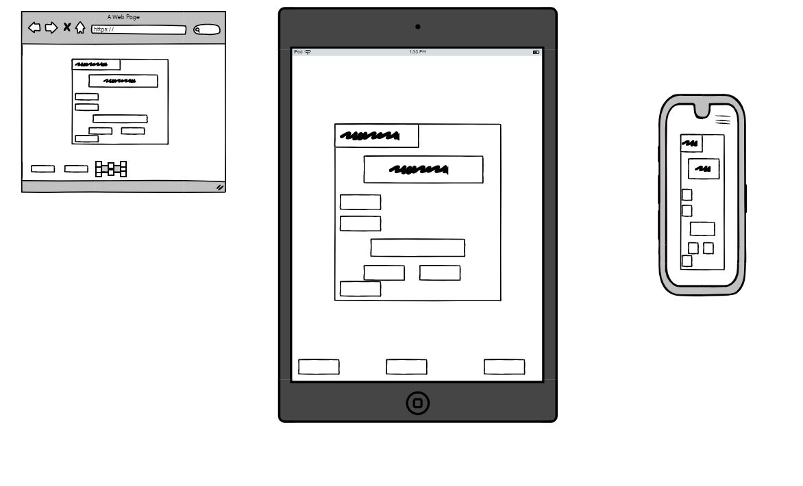

# science guessing game
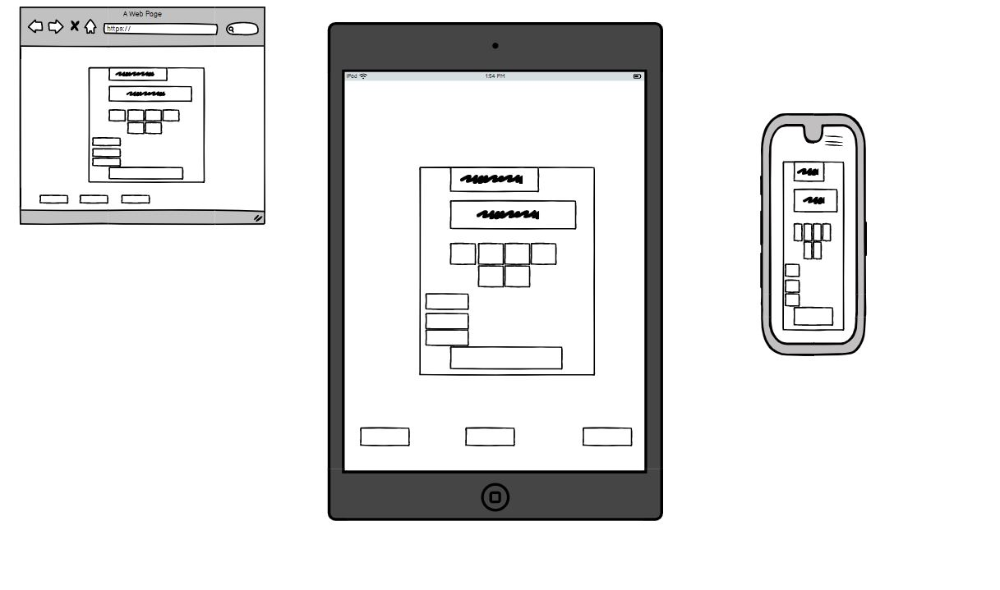

# science contact us
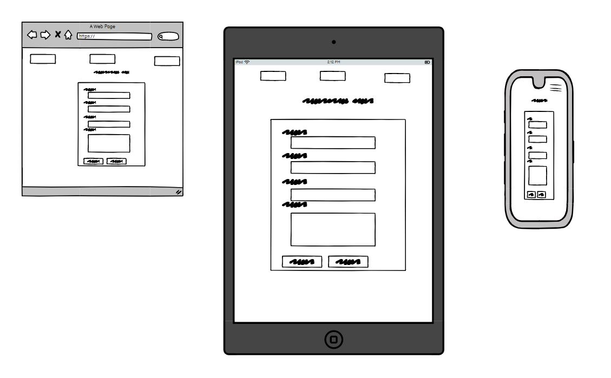

## Technologies Used

### Languages

- HTML
- CSS
- JavaScript

### Frameworks & Tools

- Git
- GitHub
- Gitpod
- Balsamiq
- Google Fonts
- Adobe Color
- Font Awsome
- Favicon
- Bootstrap
- Email js
- Chrome development tools

# Tools for validation

- [WC3 Validator](https://validator.w3.org/)
- [Jigsaw W3 Validator](https://jigsaw.w3.org/css-validator/)
- [JShint](https://jshint.com/)
- [Wave Validator](https://wave.webaim.org/)
- [Lighthouse](https://developers.google.com/web/tools/lighthouse/) 
- [Am I Responsive](http://ami.responsivedesign.is/)

## Features

### Navigation Bar
user stories covered:

- Appeared on every page (3 pages).
- Users can quickly traverse it, and the link to the page they are now on is emphasized. 
- The navbar provides links to the science scrambe, science guessing game and contact us page. 
- It is fully responsive. On smaller devices, it converts into a toggler (hamburger menu icon).

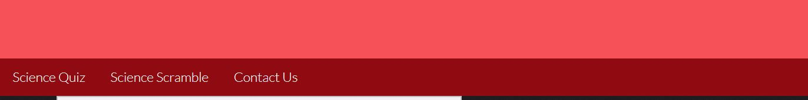

### Science scramble screen
user stories covered:

 - Instructions are clearly stated at the top of the game.
 - The chosen word is scramble.
 - Hint is given underneath the word so help the user identify the chosen word.
 - The time remaining is underneath the hint to engage and focus the user.
 - Empty text box is given for the user to type the answer
 - New word and check word button is underneath the text box to enable the user to pick a new word or 
   check the answer they have typed in the text box.
- Reset button is added underneath to reset the whole game.

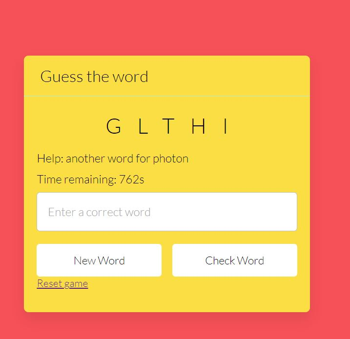

### Science guess screen
user stories covered:

 - Instructions are clearly stated at the top of the game.
 - The chosen letters are placed in vacant boxes on the word guess screen.
 - Hint is given underneath the word so help the user identify the chosen word.
-  Space is given to inform the user number of attemps left to identify the chosen word. 
-  Space is given to record the incorrect letters typed at guessing.
-  The button (new scientific term) will direct you to select a different scientific term.

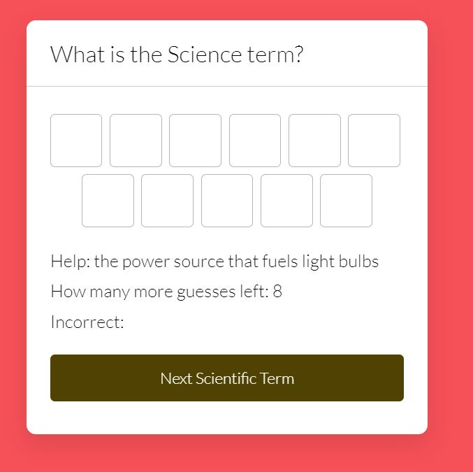

### Contact us page 
user stories covered:

- User can give feedback on the game. 
- EmailJS was used to send a message and user data in an email to the developer.
- Send button will send the message and reset button will clear the page for new message
- Once comment is sent, success message will pop for confirmation.
- scroll has been added to enable user to send or reset the page.
- Validation is added to ensure all the key text boxes are required to fill in for message to be sent out

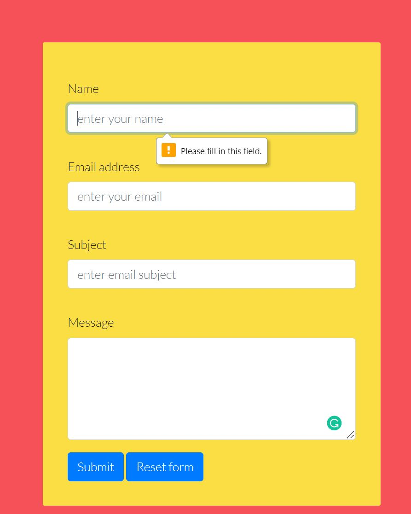
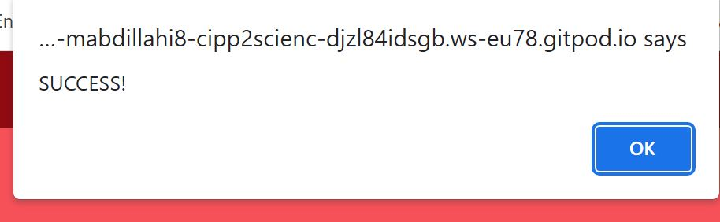
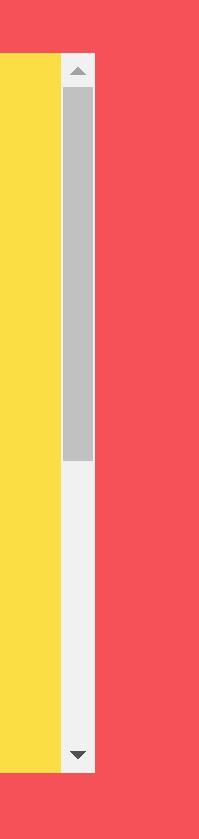

### 404 error page
user stories covered:

- If a user inputs a URL that is invalid, a 404 error page will be shown on the website.
- Has a button to return to the main screen.

 ## Validation

### HTML Validation

## Testing

### Performing tests on various devices 
The website was tested on the following devices:
- Surface Pro 7 
- iPhone 5/SE
- iPad air

Google Chrome Developer Tools Device Toggling was utilized to evaluate all webpages across all feasible device combinations

### Browser compatibility

- The following browsers have been put to the test:
  - Googe Chrome 
  - Firefox Browser 

  ### Testing user stories

1. As a first-time user, I want the game's rules to be simple to grasp.

| **Feature**       | **Action**        | **Expected Result**                  | **Actual Result** |
| ----------------- | ----------------- | ------------------------------------ | ----------------- |
|  Above the game  |  go to game page and navigating to above the game | instruction of the game given  | instruction of the game is shown |

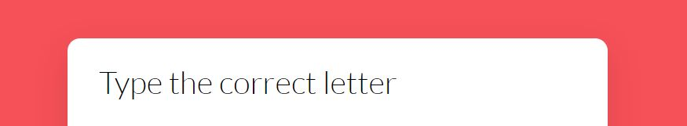

2. As a first-time user, I want to be able to play the game using the keyboard

| **Feature**       | **Action**        | **Expected Result**                  | **Actual Result** |
| ----------------- | ----------------- | ------------------------------------ | ----------------- |
|  letters pressed will visible to the user | type the letter using your keyboard | type words will be highlighted in the box or attempted area | letters will be visible in the empty boxed if correct and wrong letters will be visible in the attempted area |

3. As a first-time user, I need to be able to observe the letters I've correctly predicted so far and how many more rounds I have to guess.

| **Feature**       | **Action**        | **Expected Result**                  | **Actual Result** |
| ----------------- | ----------------- | ------------------------------------ | ----------------- |
|  letters will be present in the text boxes | letters will appear in the text box |letters will appear in the text box as users type the correct letters | letters appear in the text box if correct |

4. As a first-time user, I want to know how I fared after identifying the sentence.

| **Feature**       | **Action**        | **Expected Result**                  | **Actual Result** |
| ----------------- | ----------------- | ------------------------------------ | ----------------- |
|  correct answer will be shown in the text box | correct letters will be visible in text box |correct answer will start to appear in the text box | correct answer appear in text box |

5. As a first-time user, I want to see the word that I attempted to guess.

| **Feature**       | **Action**        | **Expected Result**                  | **Actual Result** |
| ----------------- | ----------------- | ------------------------------------ | ----------------- |
|  number of attempts will be present underneath the unknown word | number of attempts left will start to decrease as user engages with game | number of attempts will highlighted | number of attempts |

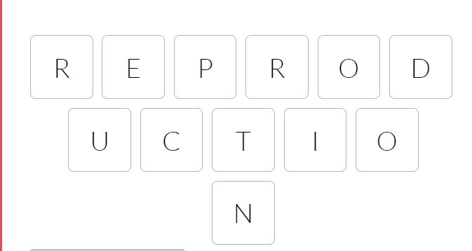

6. As a first-time user, I want to be capable to use desktop, tablet, and mobile devices to play the game.

| **Feature**       | **Action**        | **Expected Result**                  | **Actual Result** |
| ----------------- | ----------------- | ------------------------------------ | ----------------- |
|  game is visible on different devices | open the game using different devices | game is responsive on different devices | game is responsive on range of devices |

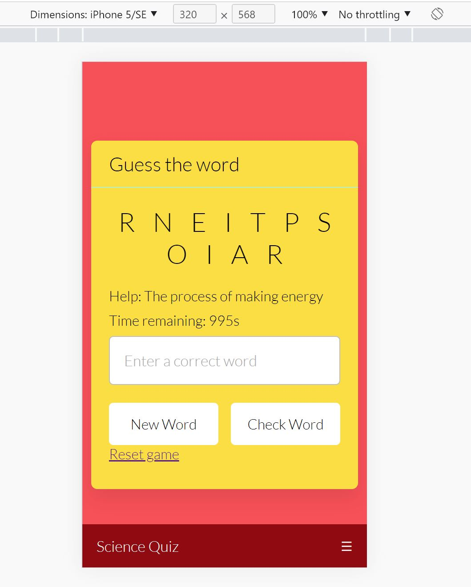

7. As a first-time user, I want to be able to communicate with the developer using the scroll down feature.

| **Feature**       | **Action**        | **Expected Result**                  | **Actual Result** |
| ----------------- | ----------------- | ------------------------------------ | ----------------- |
|  contact form | using the navbar click on contact us. Fill out the form and press submit |contact form will open and form will appear.  | contact us tab will open contact form to be filled out by user |

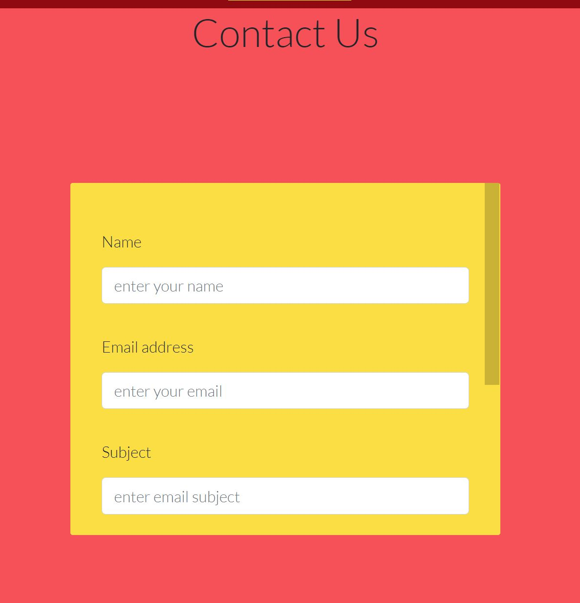
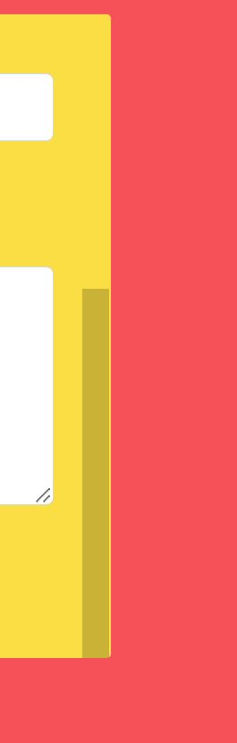

8. As a first-time user, I want confirmation that my message was sent.

| **Feature**       | **Action**        | **Expected Result**                  | **Actual Result** |
| ----------------- | ----------------- | ------------------------------------ | ----------------- |
|  success message pops up | once you submit the form, a message will appear to highlight receipt of sent form  | success message will pop up | success message will pop |

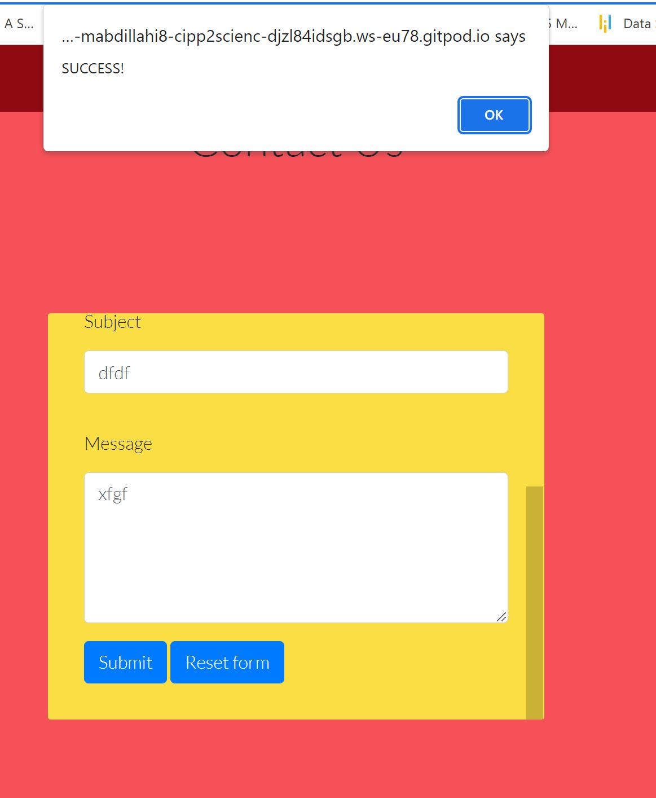

9. As a returning user, I want the game to be simple for the user to grasp. 

| **Feature**       | **Action**        | **Expected Result**                  | **Actual Result** |
| ----------------- | ----------------- | ------------------------------------ | ----------------- |
|  Above the game  |  go to game page and navigating to above the game | instruction of the game given  | instruction of the game is shown |

10. As a returning user, I expect optimal responsiveness in my game.

| **Feature**       | **Action**        | **Expected Result**                  | **Actual Result** |
| ----------------- | ----------------- | ------------------------------------ | ----------------- |
|  game is visible on different devices | open the game using different devices | game is responsive on different devices | game is responsive on range of devices |

11. As a returning user, If a user types in a URL that is invalid, I want them to land on a 404 error page instead of having  
    to utilize their browser's back button.

| **Feature**       | **Action**        | **Expected Result**                  | **Actual Result** |
| ----------------- | ----------------- | ------------------------------------ | ----------------- |
|  404 page will appear | wrong webpage is typed and user will direct to 404 | 404 page will appear | 404 page will appear |

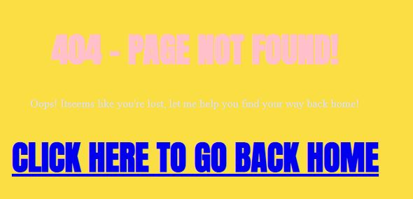

12. As a returning user, I desire that users be able to get in touch with me and offer their comments.

| **Feature**       | **Action**        | **Expected Result**                  | **Actual Result** |
| ----------------- | ----------------- | ------------------------------------ | ----------------- |
|  contact form | using the navbar click on contact us. Fill out the form and press submit |contact form will open and form will appear.  | contact us tab will open contact form to be filled out by user |

## Bugs

| **Bug** | **Fix** |
| ----------- | ----------- |
When devices were switched, the games were not responsive. | To account for the varied widths of devices, media query was utilized
